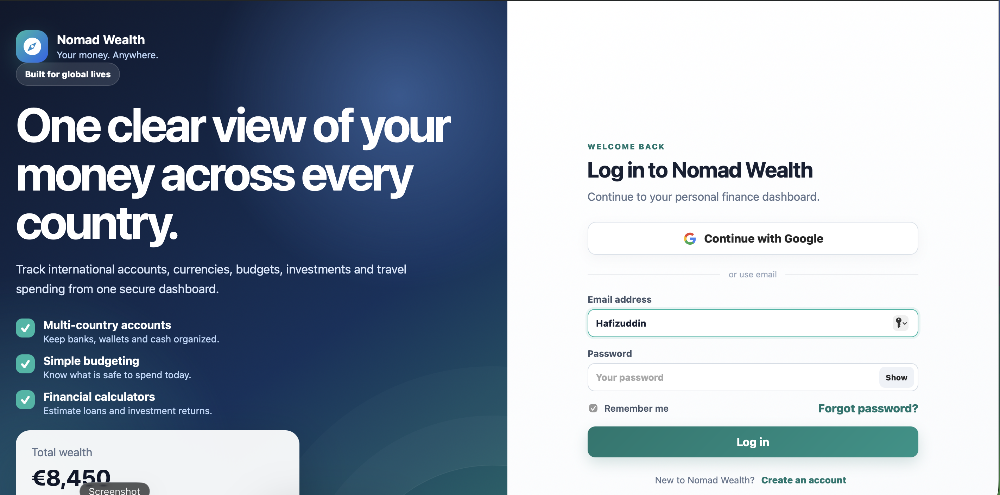

# Nomad Wealth 🧭

> One clear view of your money across every country.

A responsive, multi-country and multi-currency personal finance dashboard built for digital nomads. Track international accounts, currencies, budgets, investments, and travel spending from one secure dashboard.

🔗 **[Live Demo](https://YOUR-VERCEL-LINK.vercel.app)** *(replace after deploy)*

## Features

- 🔐 Full authentication — email/password, Google OAuth, OTP verification, password reset
- 🌍 Multi-country & multi-currency account tracking
- 💰 Simple budgeting — see what's safe to spend today
- 📊 Financial calculators for loans and investment returns
- 👤 Personalized onboarding (country, currency, user type)
- 📱 Responsive design + PWA (installable, offline-ready)

## Tech Stack

- **Frontend:** HTML, CSS, JavaScript
- **Auth:** Supabase Auth
- **Storage:** localStorage (Supabase PostgreSQL migration planned)
- **PWA:** Service Worker + Web Manifest
- **Deployment:** GitHub + Vercel

## Roadmap

- [ ] Move finance data from localStorage to Supabase PostgreSQL with Row Level Security
- [ ] Real-time currency conversion via exchange rate API
- [ ] Data export (CSV / PDF)

## Setup

See **[SETUP.md](SETUP.md)** for Supabase configuration and deployment steps.

## About

Designed and developed by **Hafizuddin** as a portfolio project demonstrating full-stack web development, authentication, and PWA implementation.
